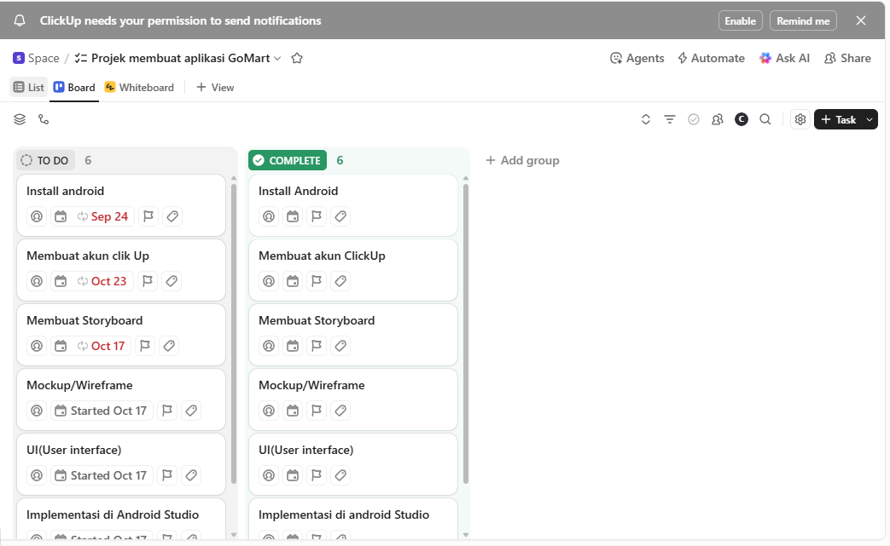
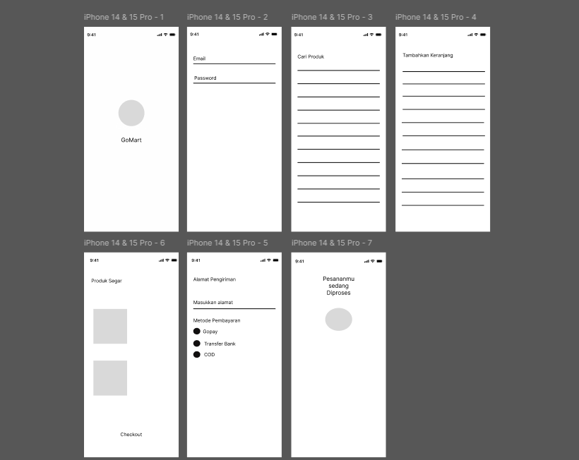
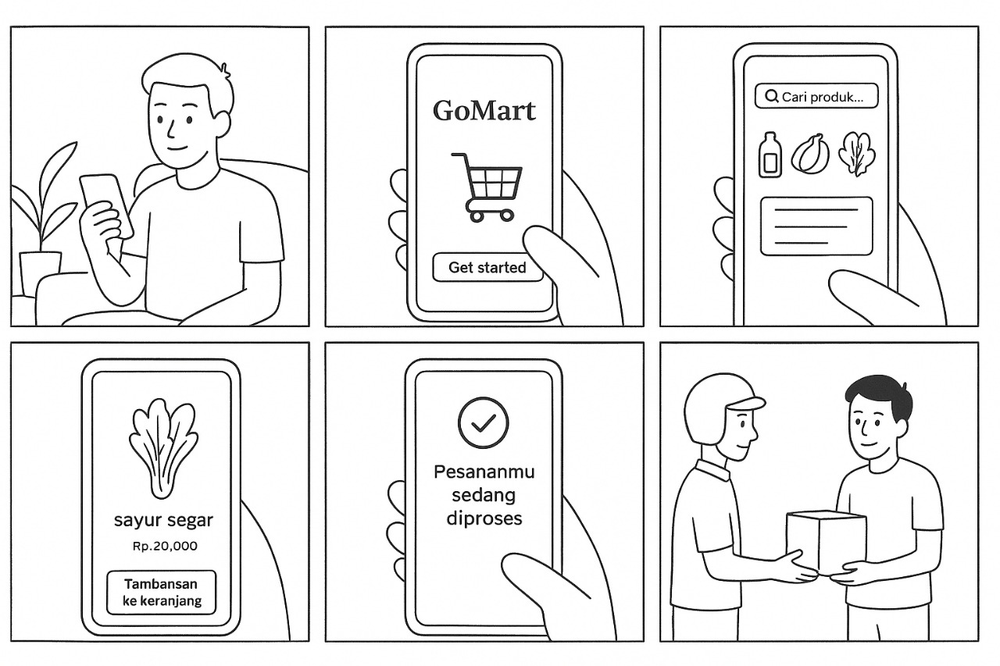
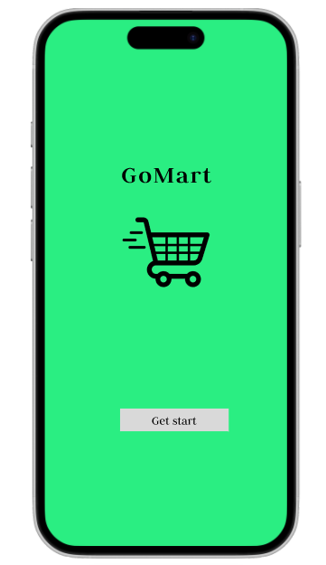
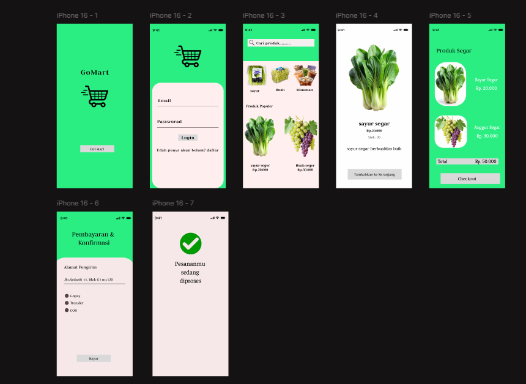

# 🛒 GoMart – UI/UX Design Project

##  Data Mahasiswa

## Nama    : Cindy Revalina Simanullang

## Nim     : 312410417

## Kelas   : TI.24 A3

## Mata Kuliah : Pemrograman Mobile 1

---

## Deskripsi Project
**GoMart** adalah proyek *UI/UX Design* untuk aplikasi belanja online bertema **produk segar** seperti sayur dan buah.  
Desain ini dibuat untuk memberikan pengalaman pengguna yang **mudah**, **menarik**, dan **nyaman** saat berbelanja melalui perangkat mobile.

Warna utama yang digunakan adalah **hijau segar** dan **putih lembut**, melambangkan kesegaran produk dan tampilan bersih yang memanjakan mata.

Proyek ini meliputi tahapan **Storyboard**, **Mockup**, **UI Design**, **UX Design**, serta pembuatan **Timeline (Gantt Chart)** menggunakan **ClickUp**.

---

## Komponen Project

## 1. Splash Screen

"""
Splash Screen adalah tampilan awal yang muncul saat aplikasi pertama kali dibuka.
Fungsinya untuk menampilkan logo dan nama aplikasi selama proses loading,
serta memberikan kesan profesional sebelum masuk ke halaman utama.
"""

*Simulasi interaksi pengguna:*  

---

## 2. Timeline / Gantt Chart (ClickUp)
Timeline dibuat di **ClickUp** dengan tampilan *Gantt View* untuk memantau jadwal pengerjaan.

---

### 3.Wireframe Project
Menampilkan kerangka dasar tampilan aplikasi (tanpa warna dan elemen dekoratif).  
Tahapan ini membantu mengatur struktur tata letak sebelum masuk ke desain visual.

**Tujuan Wireframe:**
- Menentukan posisi tombol, teks, gambar, dan navigasi.  
- Memberikan gambaran awal struktur tiap halaman.

**Struktur Halaman Wireframe GoMart:**
1. Splash Screen → Logo + tombol “Get Started”  
2. Login Page → Input email & password + tombol login  
3. Home Page → Pencarian + daftar produk  
4. Detail Produk → Gambar, harga, deskripsi, tombol tambah keranjang  
5. Keranjang Belanja → Daftar produk + total harga  
6. Pembayaran & Konfirmasi → Metode pembayaran + alamat  
7. Status Pesanan → Notifikasi pesanan sedang diproses

*Simulasi interaksi pengguna:*  

---

### 4. Storyboard Project
Menampilkan alur interaksi pengguna mulai dari:
- Membuka aplikasi (Splash Screen)
- Login ke akun
- Melihat produk
- Melakukan pembayaran hingga pesanan selesai  

 *Contoh storyboard:*  

---

### 5. Mockup Project
Menunjukkan rancangan visual awal dari aplikasi **GoMart** dengan tema warna:
- 💚 **Hijau segar (#00ff99)** sebagai warna utama  
- 🤍 **Putih lembut (#fdfdfd)** untuk latar belakang konten  
- 🖤 **Hitam & abu-abu muda** untuk teks dan ikon  

*Contoh mockup:*  

---

### 5. UI (User Interface) Project
Tampilan final antarmuka aplikasi terdiri dari beberapa halaman utama:

| Halaman | Deskripsi |
|----------|------------|
| **Splash Screen** | Logo dan tombol *Get Started* |
| **Login Page** | Form input email & password |
| **Home Page** | Daftar kategori dan produk populer |
| **Detail Produk** | Informasi lengkap produk (harga, deskripsi, tombol keranjang) |
| **Keranjang / Checkout** | Menampilkan total harga dan tombol *Checkout* |
| **Pembayaran & Konfirmasi** | Pilihan metode pembayaran dan alamat pengiriman |
| **Pesanan Diproses** | Tampilan status setelah pesanan dikirim |

 *Preview tampilan UI GoMart:*  

---

### 4.UX (User Experience) Project
Bagian UX difokuskan pada alur interaksi pengguna yang sederhana dan efisien:
- Transisi antar halaman dibuat halus menggunakan *Prototype Mode (Figma)*  
- Tombol interaktif seperti “Tambah ke Keranjang” dan “Bayar” diuji agar mudah diakses  
- Menggunakan pendekatan *user-centered design* agar pengguna dapat berbelanja tanpa kebingungan

*Simulasi interaksi pengguna:*  

---

---

**Platform:** ClickUp  
**View Mode:** Gantt Chart  

---

## Tools yang Digunakan

| Keperluan | Tools |
|------------|--------|
| Storyboard | Figma / Canva |
| Mockup | Figma |
| UI Design | Figma |
| UX Design | Figma (Prototype Mode) |
| Timeline | ClickUp |
| Dokumentasi | Word / Canva / PDF Export |

---

📎 *Link Desain di Figma:*  
[👉 Lihat Desain GoMart di Figma](https://www.figma.com/design/9Q5A7XZue7ZwdhxXMMseNv/Furniture-Shopping-Mobile-App--Community---Copy-?node-id=1-2&m=dev&t=Hk5ZBbA3BP1id1Xd-1)

---

## Kesimpulan
Desain **GoMart** dirancang dengan konsep minimalis dan segar, menggambarkan kesan alami dari produk yang dijual.  
Dengan warna hijau muda dan tampilan sederhana, pengguna dapat berbelanja dengan mudah dan nyaman.  

Aplikasi ini diharapkan menjadi contoh penerapan *UI/UX Design* yang baik dalam konteks **Pemrograman Mobile 1**.

---

*Dibuat oleh:* **Cindy Revalina Simanullang**  
*Pemrograman Mobile 1 – 2025*
